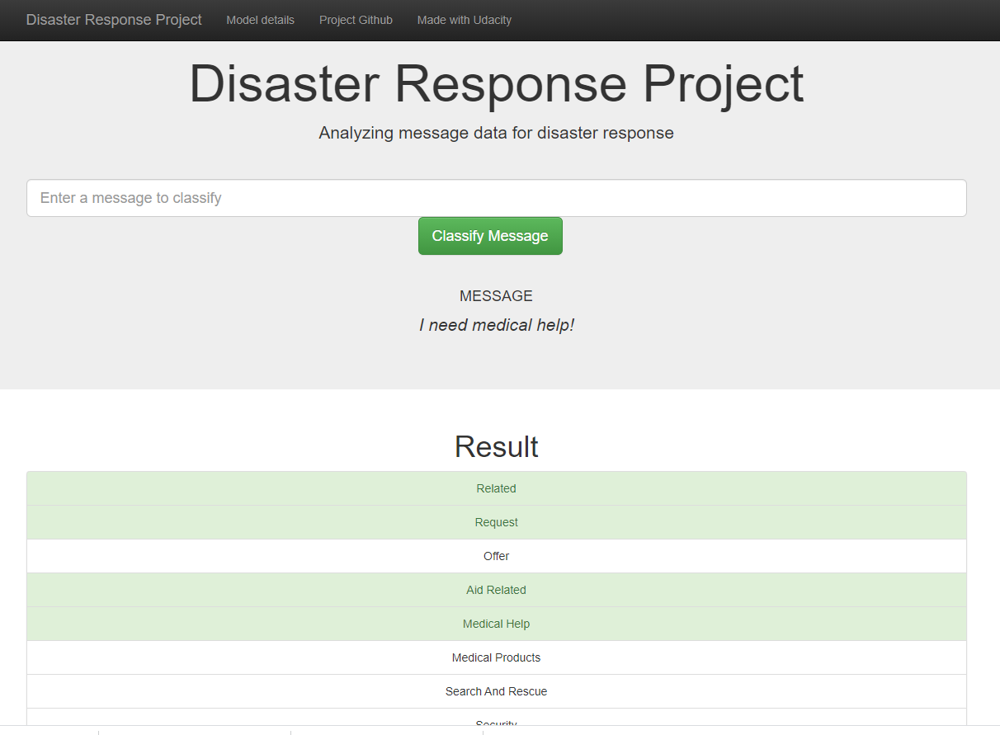

# Disaster Response Pipeline Project

Welcome to repository created on purpose of Disaster Response System.

## Motivation
Novadays, social media became one of the most important medium of spread of disaster informations. Some of the posts
can be classified as help requests. However, the requests may be connected with flood, earthquakes and many other different phenomenas.
Hence, in order to make it easier to identify what actually happend, what is the need and which services should be informed,
it seems quite usefull to provide system that would recognize the messages and categorize them.

That's what the project goal is.

Thanks to [Appen](https://appen.com/) there is an open source dataset, having gathered and labelled messages from over the world.
This dataset is used to train a machine learning model that classify messages to each of over 30 labels.

The project strongly focuses on demonstrating the process of data preparation, modelling and communication.

**The project resulted in a Flask web app, that allows to classify users queries.**

*The project is a part of the Udacity Data Science Nanodegree Program.*

 

## Sources
The Multilingual Disaster Response Messages dataset used in the project comes from **Appen** website 
and can be accessed on https://appen.com/datasets/combined-disaster-response-data/.
 
The dataset contains 30,000 messages drawn from events including an earthquake in Haiti in 2010, an earthquake in Chile in 2010, 
floods in Pakistan in 2010, super-storm Sandy in the U.S.A. in 2012, 
and news articles spanning a large number of years and 100s of different disasters.


## Files
The structure of the repository is as follows:
```
- app/
    - __init__.py
    - app.py                    # Flask app controller
    - plotting_helpers
    - templates/
        - go.html
        - master.html
        - model-info.html
- data/
    - disaster_categories.csv
    - disaster_messages.csv
    - DisasterResponse.db
    - process_data.py           # ETL pipeline
- models/
    - train_classifier.py       # Training script
    - utils.py
- img/                          # README.md images
-utils.py               
 ```
## How to?

### Clone repository
```
> git clone https://github.com/kmwolowiec/disaster-response.git
> cd disaster-response
```

### Environment
If would You like to process data, train a model and launch the app, I recommend You to use environment I provided, using 
[conda](https://docs.conda.io/projects/conda/en/latest/user-guide/install/index.html).
Environment configuration file is stored in `environment.yml` file. 
If You have already conda installed, just hit:
```
> conda env create -f environment.yml
> conda activate disresp_py38
```
> Note: I was working on Windows. Some packages may require specific versions when working on other OS.

### ETL pipeline
ETL pipeline cleans data and stores in database
```
> python data\process_data.py data\disaster_messages.csv data\disaster_categories.csv data\DisasterResponse.db
```

### ML pipeline
ML pipeline trains classifier and saves
```
> python models\train_classifier.py data\DisasterResponse.db models\classifier.pkl
```

### Launch Flask app locally
```
> cd app
> flask run
```

### All steps together
```
> git clone https://github.com/kmwolowiec/disaster-response.git
> cd disaster-response
> conda env create -f environment.yml
> conda activate disresp_py38
> python data\process_data.py data\disaster_messages.csv data\disaster_categories.csv data\DisasterResponse.db
> python models\train_classifier.py data\DisasterResponse.db models\classifier.pkl
> cd app
> flask run
```
After running app You should go into http://127.0.0.1:5000/ in Your browser.

<style>
[src*="#thumbnail"] {
   width:90px;
    vertical-align:middle;
    horiz-align: right;
}

center {
    align: center;
}


</style>


## Libraries 

<p align="center">
     
     
    
    
    
    
</p>


## Results & conclusions
The provided dataset is strongly imbalanced what makes the modeling challenge. 
Another challenge is that the task is not multiclass classification, but **multilabel**. 
That means that model have to treat the labels as multiple binary classification tasks, instead of one multiclassification.

There are multiple ways dealing with imbalanced dataset. Some of them are not easy to be implemented in scikit-learn pipelines:
* undersampling - sampling from the majority class in order to keep only a part of these points
* oversampling - replicating some points from the minority class in order to increase its cardinality
* SMOTE - Synthetic Minority Oversampling TEchnique

It this case I decided to use weights on dataset using RandomForestClassifier parameter `class_weight`. 
It's actually similar to oversampling technique.

I also decided to use more sophisticated metric for model evaluation. 
Accuracy is totally useless metric for evaluating models trained on imbalanced dataset.
Hence I used the F1-score - harmonic mean of Recall and Precision. I used it as the metric in **Bayesian Hyperoptimization**.

**What should be done in the future:**
* move to neural net based approach or train separate models for each binary task
* use word2vec or similar to allow comparing words of the same meaning 
* deeper feature engineering
* consider removing most imbalanced classess


 